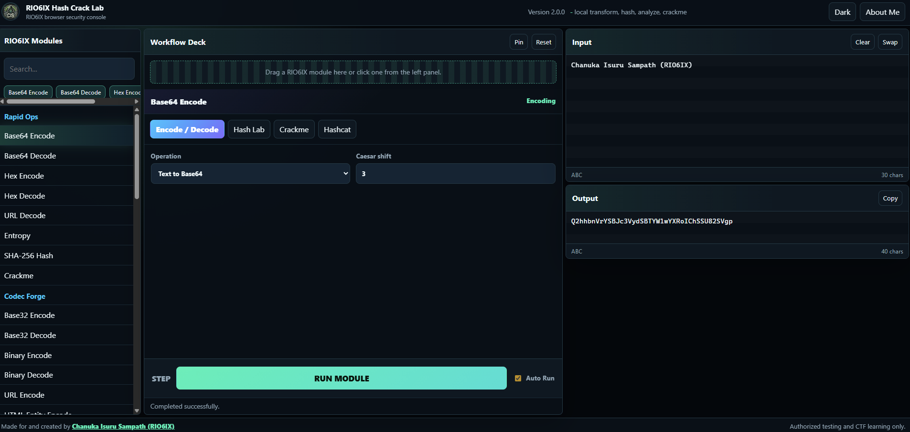

# RIO6IX Hash Crack Lab

**RIO6IX Hash Crack Lab** is a static, browser-based cybersecurity toolkit built for encoding, decoding, hashing, hash analysis, IOC cleanup, CTF practice, authorized password/hash testing labs, and Hashcat command preparation.

This project is made for and created by **Chanuka Isuru Sampath (RIO6IX)**.

> Use this project only for education, CTFs, defensive research, and systems or hashes you own or have clear permission to test.

## Preview



## Repository Description

RIO6IX Hash Crack Lab is a static browser-based security toolkit for encoding, decoding, hashing, hash analysis, IOC cleanup, Crackme practice, and Hashcat command help.

## Project Highlights

- Fully static web app
- Works on GitHub Pages
- No backend server required
- No database required
- No API key required
- No build process required
- No package manager required
- No CDN JavaScript dependencies
- Browser-side processing
- Dark mode and light mode
- Smart module search
- Related suggestion chips
- Drag-and-drop workflow module loading
- Responsive interface for desktop and mobile
- Creator About page
- Custom RIO6IX logo icon and favicon

## Live Website

Open the live GitHub Pages site:

https://rio6ix.github.io/Hash-Crack/

## Pages And Files

| File | Purpose |
| --- | --- |
| `index.html` | Main RIO6IX security console |
| `about.html` | About Me page with creator profile and links |
| `styles.css` | Full responsive UI styling, dark/light theme, layout, animations |
| `app.js` | All client-side tool logic |
| `assets/mylogo.png` | Logo, favicon, and header icon |
| `README.md` | GitHub documentation |

## Interface Features

### RIO6IX Modules Panel

The left panel contains all available tools grouped by category. It includes:

- Rapid Ops
- Codec Forge
- Intel Extract
- Text Ops
- Hash Core
- Generators

You can click a module to load it into the workflow deck.

### Smart Search

The module search is designed to find related tools, not only exact text matches.

Example search terms:

- `base64`
- `b64`
- `jwt`
- `url`
- `ioc`
- `hash`
- `password`
- `time`
- `uuid`
- `json`
- `decode`
- `encode`

The search area also shows suggestion chips for related modules.

### Drag And Drop Workflow

Modules can be dragged from the left panel into the workflow deck. This makes it feel more like a security workbench instead of a normal form page.

### Workflow Deck

The center panel shows the selected module and its options. It includes:

- Active module name
- Module category badge
- Operation selector
- Advanced settings when needed
- Run Module button
- Auto Run toggle
- Workflow reset and pin buttons

### Input And Output Panels

The right side has:

- Input editor
- Output editor
- Character counters
- Copy button
- Swap button
- Clear button

The app writes results into text areas, not into executable HTML.

## Complete Feature List

### Encode / Decode

| Tool | Description |
| --- | --- |
| Base64 Encode | Converts normal text into Base64 |
| Base64 Decode | Converts Base64 back into readable text |
| Base64URL Encode | Creates URL-safe Base64 output for tokens and web use |
| Base64URL Decode | Decodes URL-safe Base64 text |
| Base32 Encode | Converts text into Base32 |
| Base32 Decode | Converts Base32 back into text |
| Hex Encode | Converts text into hexadecimal |
| Hex Decode | Converts hexadecimal into text |
| Binary Encode | Converts text into binary byte groups |
| Binary Decode | Converts binary byte groups into text |
| URL Encode | Percent-encodes URLs and query values |
| URL Decode | Decodes percent-encoded URL text |
| HTML Entity Encode | Escapes HTML-sensitive characters |
| HTML Entity Decode | Decodes HTML entity text |

### Transform Tools

| Tool | Description |
| --- | --- |
| ROT13 | Applies ROT13 character rotation |
| Caesar Shift | Applies configurable Caesar cipher shifting |
| Morse Encode | Converts text into Morse code |
| Morse Decode | Converts Morse code into text |
| Uppercase | Converts text to uppercase |
| Lowercase | Converts text to lowercase |
| Reverse Text | Reverses text content |
| Slugify | Converts text into URL/file friendly slug format |
| Sort Lines | Sorts lines alphabetically |
| Trim Lines | Removes leading and trailing spaces from each line |
| Remove Empty Lines | Removes blank lines |
| Unique Lines | Removes duplicate lines |

### Data Format Tools

| Tool | Description |
| --- | --- |
| JSON Beautify | Formats JSON with indentation |
| JSON Minify | Compresses JSON into one line |
| JWT Decode | Decodes JWT header and payload safely in the browser |
| Hexdump | Displays byte offsets, hex bytes, and ASCII preview |

### Intel / IOC Tools

| Tool | Description |
| --- | --- |
| Extract URLs | Finds HTTP and HTTPS URLs from input text |
| Extract Emails | Finds email addresses from input text |
| Parse URL | Breaks a URL into protocol, host, path, query, hash, and parameters |
| Defang IOCs | Converts URLs/domains/emails into safer shareable IOC format |
| Refang IOCs | Restores defanged indicators back to normal format |

### Analysis Tools

| Tool | Description |
| --- | --- |
| Entropy | Calculates text entropy and estimated total entropy |
| Text Stats | Shows characters, bytes, lines, words, and unique line count |
| Password Score | Gives a simple password strength score and improvement hints |
| Hash Analyzer | Detects likely hash formats by length, prefix, and character pattern |

### Hashing Tools

| Tool | Description |
| --- | --- |
| MD5 | Generates MD5 hashes for legacy/CTF use |
| SHA-1 | Generates SHA-1 hashes |
| SHA-256 | Generates SHA-256 hashes |
| SHA-384 | Generates SHA-384 hashes |
| SHA-512 | Generates SHA-512 hashes |
| HMAC | Generates HMAC output for supported SHA algorithms |
| PBKDF2-SHA256 | Derives a PBKDF2 key using password, salt, and iteration count |

### Generator Tools

| Tool | Description |
| --- | --- |
| UUID v4 | Generates a random UUID v4 |
| Timestamp | Generates ISO time, Unix seconds, Unix milliseconds, and local time |

## Crackme Lab

The Crackme module is a safe, browser-only hash matching practice lab.

It supports:

- Target hash list
- Wordlist candidates
- SHA-256
- SHA-512
- SHA-1
- MD5
- No salt
- Salt + password
- Password + salt

The Crackme lab is designed for:

- CTF practice
- classroom demos
- authorized hash testing
- local experiments
- learning how hash comparisons work

Browser-protection limits:

- Maximum 5,000 wordlist candidates
- Maximum 200 target hashes
- Input size limits to reduce accidental browser freezes

## Hashcat Helper

The Hashcat Helper builds starter Hashcat commands for authorized testing.

Supported hash modes include:

- MD5 - mode `0`
- SHA1 - mode `100`
- SHA2-256 - mode `1400`
- SHA2-512 - mode `1700`
- NTLM - mode `1000`
- bcrypt - mode `3200`
- sha512crypt - mode `1800`

Supported attack modes include:

- Dictionary attack - mode `0`
- Mask attack - mode `3`
- Wordlist + mask - mode `6`
- Mask + wordlist - mode `7`

Optional command flags:

- Optimized kernels: `-O`
- Status timer: `--status --status-timer=30`
- Restore support: `--restore`

## About Page

The project includes a styled `about.html` page for **Chanuka Isuru Sampath (RIO6IX)**.

It includes:

- Creator profile
- RIO6IX identity section
- Cybersecurity focus tags
- Portfolio button
- Tool launch button
- Official link cards
- Static/local/project ownership highlights

## Creator Links

- LinkedIn: https://www.linkedin.com/in/chanuka-isuru-sampath/
- GitHub: https://github.com/RIO6IX
- Medium: https://medium.com/@chanuka1
- Portfolio Website: https://rio6ix.github.io/chanuka/
- YouTube: https://www.youtube.com/@chanukaisuru0
- Medium Publication: https://rio6ix.medium.com/

## Security Design

This project is built with a static-first security model.

Security-focused design decisions:

- No backend application
- No database
- No user accounts
- No cookies
- No analytics
- No telemetry
- No CDN JavaScript
- No third-party JavaScript packages
- No server-side processing
- No form submissions
- No API calls
- User input stays in the browser
- Results are written into text fields
- User input is not executed as JavaScript
- User input is not inserted as trusted HTML
- Content Security Policy is included
- Input size limits are included

## Content Security Policy

The HTML includes a restrictive CSP meta tag:

```text
default-src 'self';
script-src 'self';
style-src 'self';
img-src 'self' data:;
font-src 'self';
connect-src 'none';
object-src 'none';
base-uri 'none';
form-action 'none';
frame-ancestors 'none';
upgrade-insecure-requests
```

This helps keep the static page locked down for GitHub Pages hosting.

## Important Ethical Notice

This tool is for:

- cybersecurity education
- CTF practice
- defensive research
- personal labs
- authorized testing
- safe hash learning

Do not use it for:

- attacking accounts
- testing hashes without permission
- stealing credentials
- unauthorized cracking
- illegal access
- harmful activity

You are responsible for using this project legally and ethically.

## Project Status

Current version: `2.0.0`

The project is usable as a static browser security console and can be extended with more modules in `app.js`.
